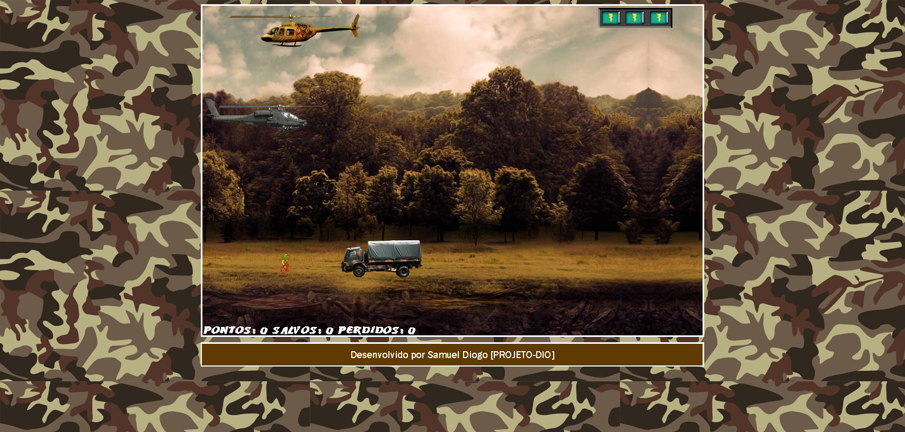
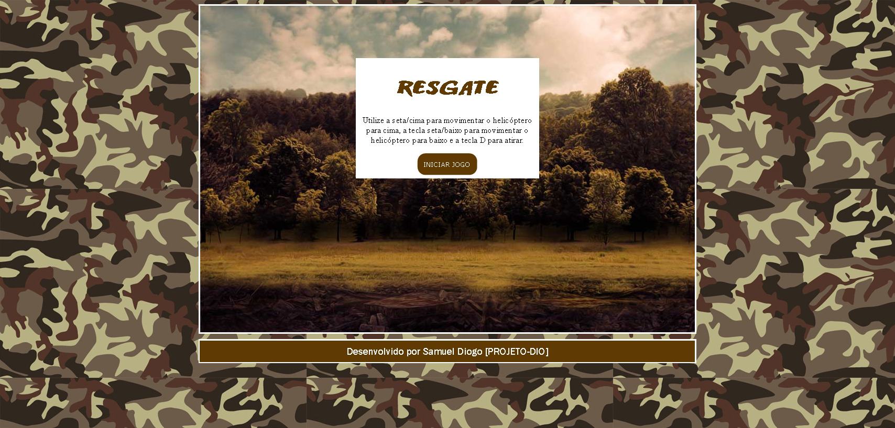
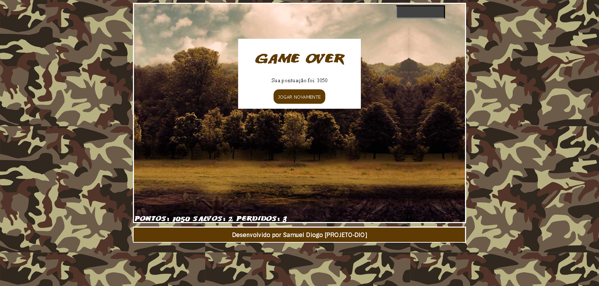

# JOGO-AERONAVES

- Utilizando o HTML5 juntamente com as folhas de estilo CSS3 e o JavaScript, é possível desenvolver jogos de forma rápida e compatível com diversas plataformas, incluindo dispositivos móveis. No projeto são discutidas as etapas de desenvolvimento de jogos em HTML5, CSS3 e JavaScript do início ao fim, utilizando a didática passo a passo em seu desenvolvimento. Neste projeto, especificamente, os jogos serão publicados de forma que possam ser acessados via browser.

<h1 align="center">
Projeto DIO - Jogo AERONAVES
</h1>

# Participantes

[Sammynauta](https://github.com/Sammynauta)

## Resources

- [x] HTML, CSS, JAVASCRIPT.
- [x] Images (JPEG, PNG)

### Slides

